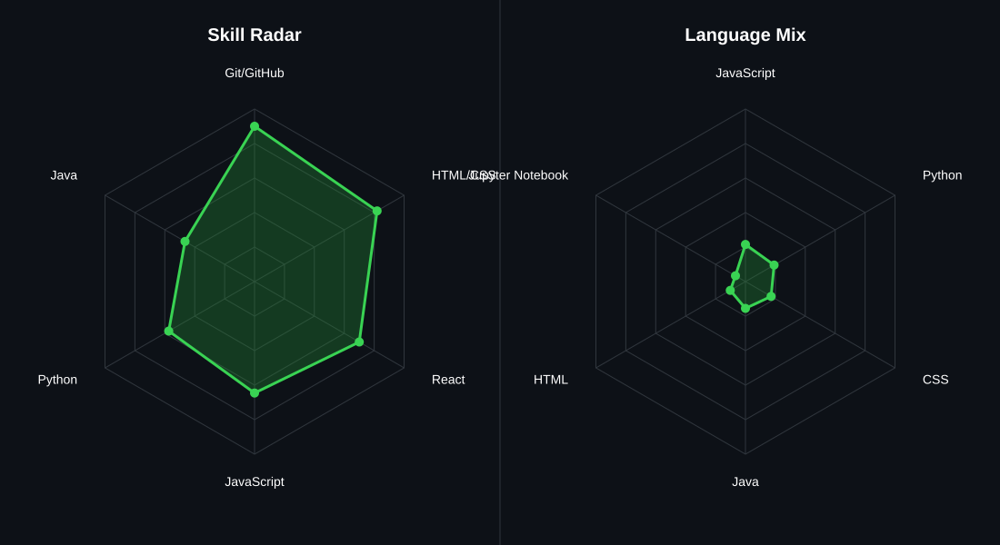

# Hi, I’m Sourabh Pandey👋

 A student who is curious about **how technology is built and what happens behind the scenes**.

Whenever I see something someone has built, I start asking: *How does this work? How did they code it? How did they make it this polished? Could I build something similar?*

That curiosity keeps me learning. I enjoy diving into difficult topics and the satisfaction of finally understanding something that once seemed complicated.

I work with **HTML, CSS, JavaScript, Python, C++, and Java**, and I'm currently learning **React**. I enjoy building websites, solving DSA problems, and exploring new areas of technology.

I've built projects like an **AI Disaster Response system for the Meta × Hugging Face Hackathon**, a **Nokia-style Snake Game**, and various frontend projects. Through them, I've learned about **prototyping, deployment, and learning by building**.

I'm exploring **open source and hackathons** while figuring out what kind of engineer I want to become.

I don't want my GitHub to just show what I've learned. I want it to show my journey of **curiosity, experimentation, persistence, and continuous improvement**.

**I don't just want to learn technology. I want to immerse myself in it, understand how it works, and eventually build things that make other people curious.**

## 🌐 Socials:
   

# 💻 Tech Stack:
             

## 🧠 My Skill Radar

  

